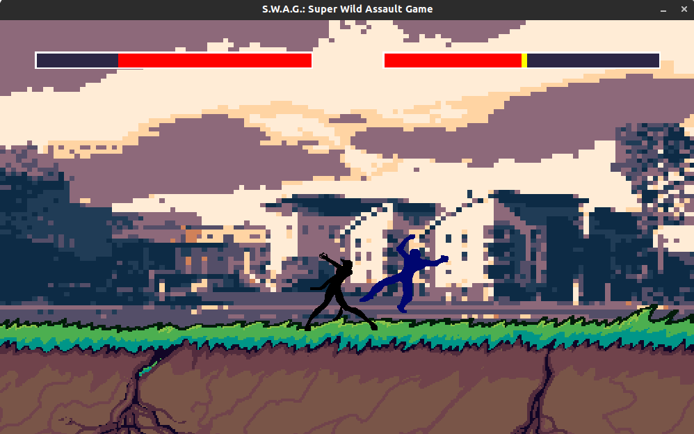
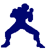
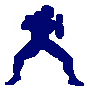
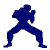
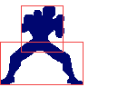
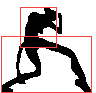
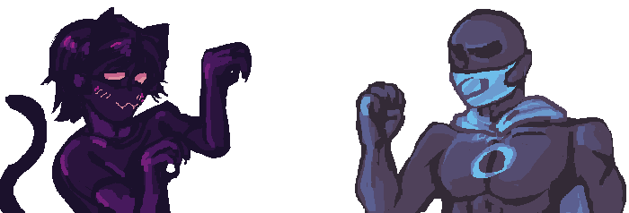

 

 
 
<section id="downloads">
          <a href="./download" class="btn btn-github">Play the Game</a>
        </section>

 
 

## S.W.A.G. is a platform fighter game drawing inspiration from M.U.G.E.N., Super Smash Bros., and Street Fighter. Our goal was to create a configurable engine similar to M.U.G.E.N. that new characters can be added to with relative ease.
 
 
 
 

# **The Engine**: *Create your own character*
- Given the nature of S.W.A.G., anyone is able to create their own characters and add them to the fighting game! Here are the requirements of the characters as you add them in, in their own folder in the `/chars/` folder.
 
 

### Character Information:
`Within the [character].info file, in json style.`
 

1. **Name, Health, Weight, and Physics:**

    - Customize the max health and weight of the character to set the feeling of the way that they move. 
    
    - **Ground physics** include ground acceleration, speed, and traction across the floor of the stage.
    
    - **Aerial physics** include air acceleration, speed, fall speed, and jump acceleration. 
 
 

2. **Moveset Animation Interactions:**
    - **Allowed states**: When the certain character animation can start
    - **Cancelable start**: At what frame the move can be canceled by letting go a key press
    - **Can move**: whether or not a player can go right or left during an animation *(i.e. blocking or jabbing)*.
 
 

### Sprites: Moveset Animations:
`Within the /SPRITES/[move]/ folder.`
 

Add frames for animations for each the moves the character has! Here is the list of moves: **Idle**, **walk**, **jab**, **block**, **air idle**, **jump**, **land**, and got **hit**. When implemented with the *Player* script, this information is immediately utilized by the engine.

 

       

       

 
 

### Framedata: Hitboxes and Hurtboxes:
`Within the [character].anim file, in CSV style.`
 
Give information about the size and location of these boxes which control the interaction between characters, such as whether or not a player's hit connects with the head and torso, or legs.
- **Hitbox**: Where the player is vulnerable to being hit
- **Hurtbox**: Where contact leads to damage of the opponent

 

 
 
 

<h1> About Us: </h1>
<h2> Jacob Smilg </h2>

 Class of 2024. Hates video games.

 
<h2> Melissa Kazazic </h2>

 Class of 2024. Jock that shoves people into lockers.

 
 

